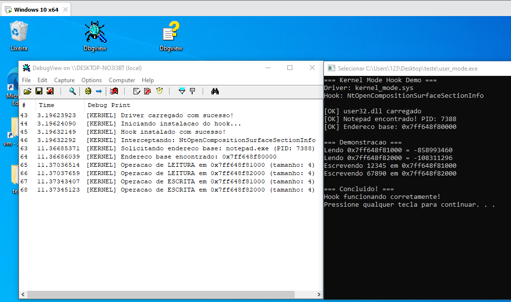

# Windows Kernel Function Hooking

Hook system calls on Windows by intercepting kernel functions

## How does it work?

This project demonstrates kernel function hooking by intercepting calls to `NtOpenCompositionSurfaceSectionInfo` in the Windows kernel. The driver replaces the original function with custom code that can intercept, log, or modify system calls.

The driver hooks `NtOpenCompositionSurfaceSectionInfo` from `dxgkrnl.sys` (DirectX Graphics Kernel) by changing the first 12 bytes of the function to point to its own handler. This allows interception of all calls to this function for monitoring or modification.

## Demo

The demo shows the hook in action, with the user-mode application communicating with the kernel driver to demonstrate memory operations and function interception.

MAKE SURE TO ENABLE TEST MODE TO TEST THIS PROJECT. IF YOU WISH TO USE IT OUTSIDE TEST MODE, USE YOUR CUSTOM DRIVER LOADER OR SIGN THE DRIVER.

NOTE: THIS IS FOR EDUCATIONAL PURPOSES ONLY. I WON'T BE ADDING ANY ANTI-DETECTION OR PRODUCTION-READY CODE.

For more detailed technical analysis and study notes on Windows kernel debugging and function hooking, check out my personal study blog:

**[Finding functions in Windows with WinDbg — Part 1](https://cnthigu.github.io/encontrando-funcoes-windbg/)**

*Note: This is my personal study blog with technical notes. If it helps with your learning, feel free to use!*
